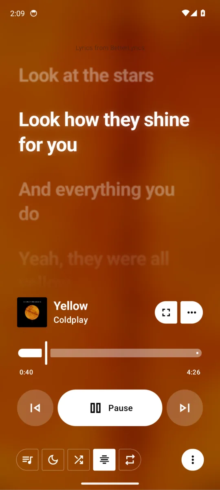
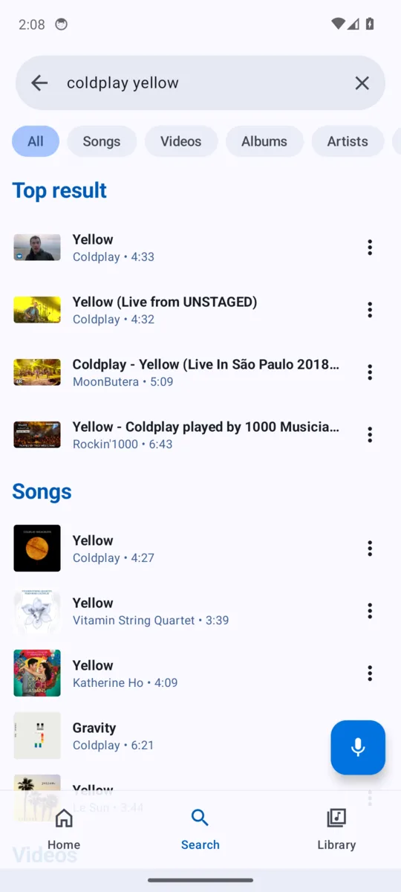

# Utaloom Android

An independent YouTube Music client for Android, part of the Utaloom project.

[Android repository](https://github.com/cabrata/utaloom-android) · [Desktop app](https://github.com/cabrata/utaloom) · [Releases](https://github.com/cabrata/utaloom-android/releases) · [Report an issue](https://github.com/cabrata/utaloom-android/issues)

## About

This repository contains the native Android app, built with Kotlin and Jetpack Compose. The desktop app for Linux and Windows is maintained separately in [cabrata/utaloom](https://github.com/cabrata/utaloom). The two apps share the Utaloom name, not a codebase or release cycle.

Utaloom Android is independently maintained by [cabrata](https://github.com/cabrata). It is not affiliated with, endorsed by, or maintained by Metro Group, Metrolist, or MetrolistGroup. Please report Android issues in this repository, not to the upstream projects.

## Features

- YouTube Music streaming and background playback.
- Offline downloads and cache, library management, playlists, and account sync.
- Artwork-based player backgrounds and synchronized lyrics with word-by-word highlighting.
- Audio normalization, tempo and pitch controls, equalizer, crossfade, and sleep timer.
- Light, dark, and black themes, with Android home-screen widgets.
- Optional lyrics translation and Last.fm integration, depending on provider availability and configuration.

## Screenshots

<p align="center">
  
  
  
  
</p>

## Install

Requires Android 8.0 or newer (API 26+). APKs, when published, are available from this repository's [Releases](https://github.com/cabrata/utaloom-android/releases).

## Build

Requires JDK 21 and the Android SDK with the compile SDK declared in `app/build.gradle.kts` (currently API 37).

```bash
git clone https://github.com/cabrata/utaloom-android.git
cd utaloom-android
./gradlew :app:assembleFossDebug
```

The APK is generated at `app/build/outputs/apk/foss/debug/app-foss-debug.apk`.

The application ID is `com.cabrata.utaloom.android`; local debug builds add `.debug`. It can be installed alongside the older apps. Existing app data is not automatically migrated. Release publishing requires signing secrets configured in this repository. Secrets are not copied from other repositories.

## License and attribution

Utaloom Android is distributed under [GNU GPL v3](LICENSE). Its Android codebase derives from [Metrolist](https://github.com/MetrolistGroup/Metrolist), with earlier work from [InnerTune](https://github.com/z-huang/InnerTune) and [OuterTune](https://github.com/DD3Boh/OuterTune), and uses third-party open-source libraries. Original copyright notices and license terms are preserved. Attribution records source provenance, not affiliation or endorsement.

Some internal Kotlin packages and resource identifiers retain their original names to avoid unnecessary code and database migrations. They are implementation details, not the app's public identity.

## Disclaimer

Utaloom Android is not affiliated with YouTube, YouTube Music, Google, Apple, Metro Group, Metrolist, or MetrolistGroup. Trademarks belong to their respective owners. Streaming availability depends on YouTube Music support in your region and the availability of external services.
